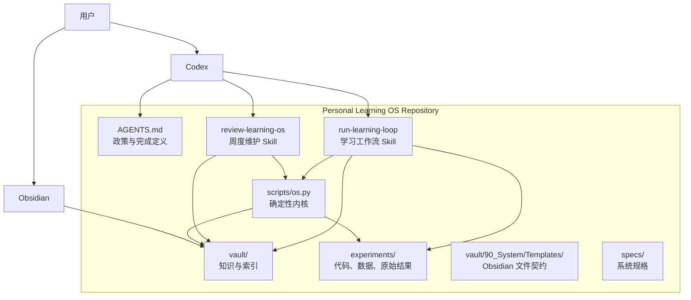
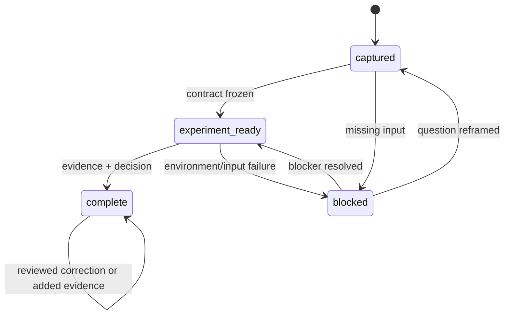

# Personal Learning OS v1 — Design

## 1. Design goals

OS v1 需要做到：

1. 让一个真实技术问题以低摩擦进入学习闭环。
2. 让实验结果和工程判断可以被审查、复现和再次调用。
3. 让 Codex 保持推理灵活性，同时把状态、索引和完整性校验交给确定性代码。
4. 保持本地优先、纯文本、无插件依赖，并为后续演化保留稳定文件契约。

核心设计原则：

> LLM 负责判断，脚本负责确定性，Markdown 负责长期资产，人负责最终确认。

## 2. System context



Obsidian 是阅读和链接界面，不是运行时依赖。Codex 是交互和判断层，不是唯一事实来源。
仓库中的 Markdown、实验代码和原始结果才是长期资产。

## 3. Architectural model

可以用操作系统类比理解，但不把类比变成额外复杂度：

| OS 概念 | v1 对应物 | 职责 |
|---|---|---|
| Kernel | `scripts/os.py` | 校验状态、同步索引、生成周报 |
| System policy | `AGENTS.md` | 证据规则、范围控制、完成定义 |
| Process | learning loop | 一个问题从捕获到完成的生命周期 |
| Driver | Codex Skills | 把自然语言意图映射到确定工作流 |
| Filesystem | `vault/`、`experiments/` | 持久知识与原始证据 |
| Process table | `Learning Loops.md` | 当前 active、blocked、complete 视图 |
| Audit layer | Git-compatible files | 人工审查和未来版本追踪 |

## 4. Module boundaries

### 4.1 Interaction layer

Components:

- Codex app/CLI
- Obsidian

Responsibilities:

- 接收自然语言问题。
- 展示和编辑 Markdown。
- 让用户审查最终判断。

Non-responsibilities:

- 不把聊天记录本身当作唯一知识资产。
- 不依赖 Obsidian 插件执行核心工作流。

### 4.2 Policy layer

Component: `AGENTS.md`

Responsibilities:

- 定义证据等级和禁止行为。
- 定义 learning loop 的完成条件。
- 约束新增目录、依赖、Skill 和自动化。
- 指定验证命令。

`AGENTS.md` 保持短小，只包含跨任务长期生效的规则。详细流程放入 Skills，
数据结构放入模板和设计文档。

### 4.3 Workflow layer

Components:

- `.agents/skills/run-learning-loop/`
- `.agents/skills/review-learning-os/`

`run-learning-loop` responsibilities:

- 检索相似历史记录。
- 建立问题、假设和实验契约。
- 设计并运行最小实验。
- 区分 observation 与 decision。
- 调用确定性内核同步索引和验证结果。

`review-learning-os` responsibilities:

- 调用内核扫描系统健康状况。
- 生成一份可审查的周报。
- 提出合并、补证据、解除阻塞或继续实验的建议。
- 不直接重写或删除 completed loops。

Skills 不实现 Markdown 解析、唯一性检查或索引排序；这些属于确定性内核。

### 4.4 Deterministic kernel

Component: `scripts/os.py`

v1 commands:

```text
python3 scripts/os.py validate
python3 scripts/os.py sync-index
python3 scripts/os.py weekly-review [--date YYYY-MM-DD]
```

Responsibilities:

- 解析项目使用的有限 YAML frontmatter 子集。
- 检查 loop ID 唯一性、状态合法性和必需章节。
- 对 completed loop 检查完成定义。
- 检查实验路径和 JSON 结果可读取性。
- 从 loop notes 生成中央索引的受控区域。
- 生成周度健康报告草稿。
- 使用非零退出码报告结构错误。

Non-responsibilities:

- 不评价技术结论是否正确。
- 不自动运行任意实验。
- 不联网、不调用 LLM。
- 不删除、合并或改写 completed loops。

实现只使用 Python 标准库，避免为简单 YAML 子集引入运行时依赖。

### 4.5 Knowledge store

Component: `vault/`

Source of truth:

- 每个 learning loop 的 Markdown 文件。
- 每周维护报告。

Derived view:

- `vault/00_Index/Learning Loops.md`

中央索引不是状态的权威来源。状态来自各 loop 的 frontmatter，索引由内核重新生成。
因此索引丢失时可以恢复，也不会要求用户重复维护同一状态。

### 4.6 Evidence store

Component: `experiments/<loop-id>/`

Each experiment directory may contain:

- runnable code;
- fixed input data or input manifest;
- environment/dependency declaration when required;
- raw machine-readable result;
- optional logs needed to reproduce the observation.

The durable interpretation remains in the loop note. Raw result files do not become engineering
decisions automatically.

## 5. Proposed repository layout

```text
.
├── AGENTS.md
├── README.md
├── .agents/
│   └── skills/
│       ├── run-learning-loop/
│       │   ├── SKILL.md
│       │   └── agents/openai.yaml
│       └── review-learning-os/
│           ├── SKILL.md
│           └── agents/openai.yaml
├── scripts/
│   └── os.py
├── vault/
│   ├── Home.md
│   ├── 00_Index/
│   │   └── Learning Loops.md
│   ├── 10_Loops/
│   │   └── <loop-id>.md
│   ├── 20_Reviews/
│   │   └── <year>-W<week>.md
│   └── 90_System/
│       └── Templates/
│           ├── learning-loop.md
│           └── weekly-review.md
├── experiments/
│   └── <loop-id>/
│       ├── ...
│       └── result.json
├── tests/
│   ├── test_os.py
│   └── fixtures/
└── specs/
    └── personal-learning-os-v1/
        ├── requirements.md
        ├── design.md
        └── tasks.md
```

v1 不建立独立 Concepts、Architecture、Interview 或 Cards 目录。
当一个概念被至少三个不同 loops 复用并出现明显重复时，再考虑把它提升为独立知识对象。

## 6. Learning-loop data contract

### 6.1 Frontmatter

Required fields:

```yaml
---
id: YYYY-MM-DD-topic-slug
type: learning-loop
status: captured
created: YYYY-MM-DD
updated: YYYY-MM-DD
tags:
  - learning-loop
---
```

Allowed statuses:

- `captured`
- `experiment-ready`
- `blocked`
- `complete`

v1 不增加 confidence、domain、review-date 等强制字段。它们可以从内容或标签表达；
只有实际使用证明需要查询这些字段时，才升级 schema。

### 6.2 Required body sections

1. 触发问题
2. 当前理解
3. 可证伪假设
4. 实验契约
5. 证据
6. 工程判断
7. 关联
8. 未来复用触发器
9. 下一步

### 6.3 Completion contract

For `complete`, the validator requires:

- 非空原始问题；
- hypothesis 与 falsification condition；
- metric 与 threshold；
- reproduction command or named external evidence path；
- at least one observation；
- decision、scope 和 limitation；
- reuse trigger；
- no unresolved placeholder such as `待运行` or `待填写`；
- presence in the generated index after sync.

技术真实性仍由人和 Codex 审查，脚本只检查结构与可追踪性。

## 7. State machine



Rules:

- 实验未运行不等于失败；使用 `experiment-ready`。
- 假设被证伪仍然可以 `complete`。
- `complete` 可以追加更正和新证据，但不能静默删除旧观察。
- v1 不增加 `archived` 或 `superseded`，避免提前设计生命周期。

## 8. Core workflows

### 8.1 Run a learning loop

```text
User prompt
  → search existing titles/tags/text
  → reuse or create loop
  → freeze hypothesis and contract
  → create minimal experiment
  → execute and preserve raw result
  → write observation
  → write bounded decision
  → sync-index
  → validate
  → human review
```

The Skill may stop at `captured`, `experiment-ready`, or `blocked` when evidence is unavailable.

### 8.2 Reuse prior knowledge

v1 retrieval order:

1. central index;
2. filename/title/tag search;
3. repository full-text search;
4. explicit Obsidian links;
5. inspect a small set of matching loops.

Embeddings are added only if real retrieval tasks repeatedly exceed the one-minute target.

### 8.3 Weekly review

```text
User invokes review Skill
  → validate repository
  → collect status and updated dates
  → detect stale active/blocked loops
  → detect missing evidence and repeated titles/tags
  → generate review draft
  → user accepts, edits, or rejects suggestions
```

The review is diagnostic. It does not mutate completed conclusions.

## 9. Generated index design

`Learning Loops.md` contains a human-authored introduction and a generated region:

```markdown
<!-- BEGIN GENERATED: LEARNING LOOPS -->
## Active
...
## Blocked
...
## Complete
...
<!-- END GENERATED: LEARNING LOOPS -->
```

`sync-index` only replaces content inside these markers. Ordering:

- active and blocked: most recently updated first;
- complete: most recently updated first;
- ties: loop ID ascending.

Each entry includes title, link, status, and for active/blocked loops the extracted next action.

## 10. Weekly-review contract

Weekly reports live under `vault/20_Reviews/` and include:

- repository validation result;
- status counts;
- active loops with next actions;
- blocked loops with named blockers;
- completed loops changed during the period;
- structural anomalies;
- possible duplicates;
- proposed priorities for the next week;
- human decision section.

The report is a snapshot, not a second source of truth.

## 11. Error handling

- Structural validation error: exit nonzero and list file, rule, and remediation.
- Missing experiment dependency: loop becomes `blocked` or remains `experiment-ready`.
- Experiment returns a negative result: preserve result and complete the loop if interpretation is done.
- Index drift: `validate` reports it; `sync-index` repairs only the generated region.
- Malformed frontmatter: do not guess status; report the file as invalid.
- Duplicate loop ID: block index generation until resolved.

## 12. Human control and safety

- All durable assets remain plain files inside the workspace.
- Skills may create drafts and run scoped experiments authorized by the user request.
- Completed loops are never automatically deleted or merged.
- Weekly review proposes changes rather than applying semantic edits.
- External claims that affect decisions use primary sources with access dates.
- Experiment scripts avoid destructive operations and declare external side effects when unavoidable.
- Git history is recommended as the review/audit layer, but automatic Git mutation is outside v1.

## 13. Testing strategy

### Unit tests

Use Python `unittest` and temporary directories to test:

- frontmatter parsing;
- allowed statuses;
- required-section detection;
- duplicate ID detection;
- placeholder detection;
- index ordering and generated-region replacement;
- weekly-review aggregation.

### Integration tests

- Validate the current repository containing both completed loops.
- Regenerate the index and verify a second run produces no diff.
- Generate a weekly report from fixtures and verify completed loops are not modified.
- Run both existing experiment scripts and verify their result contracts.

### Acceptance checks

- A fresh Codex session can use `$run-learning-loop`.
- A weekly review can be invoked through one Skill.
- Existing loops and experiment results remain unchanged after migration.
- The full validation command succeeds without third-party dependencies.

## 14. Migration plan

1. Add generated-region markers to the existing index without changing loop content.
2. Add `scripts/os.py` and tests.
3. Run `validate`; resolve only structural mismatches.
4. Run `sync-index` and confirm both existing loops remain present.
5. Update `run-learning-loop` to call sync and validate.
6. Add the weekly review template and Skill.
7. Generate the first review as a smoke test.

Existing experiment code and raw results are not moved.

## 15. Key trade-offs

### One loop note vs normalized knowledge objects

Decision: keep one loop note.

Reason: it minimizes duplicate maintenance and preserves the causal chain from question to decision.
Separate concept pages are promoted only after repeated reuse.

### Markdown vs database

Decision: Markdown is the system of record.

Reason: it is inspectable, portable, Obsidian-native, Git-friendly, and sufficient for v1 scale.

### LLM-only maintenance vs deterministic tooling

Decision: combine Codex Skills with a small standard-library kernel.

Reason: LLMs are suitable for interpretation and experiment design; exact indexing and structural
validation should be deterministic.

### Manual vs scheduled weekly review

Decision: manual invocation in v1.

Reason: the system first needs evidence that the review is useful before introducing background work.

### Full semantic retrieval vs text search

Decision: index, tags, links, and full-text search first.

Reason: there is no demonstrated retrieval failure at the current corpus size.

## 16. Evolution triggers

Only consider expansion when observed:

- Retrieval repeatedly takes over one minute → evaluate local semantic search.
- Three or more loops repeat the same concept explanation → promote a concept page.
- External-source capture repeatedly dominates loop time → design an ingestion workflow.
- Weekly review repeatedly produces the same safe mechanical edits → consider automation.
- Multiple users need shared access → design identity, sync, permissions, and conflict handling as a new product.

## 17. Requirement traceability

| Requirement | Design elements |
|---|---|
| R1 Capture | run-learning-loop, loop contract, text-first retrieval |
| R2 Test contract | required sections, state machine, Skill workflow |
| R3 Evidence | experiments store, completion validator |
| R4 Judgment | loop sections, human review, negative-result rule |
| R5 Reuse | retrieval order, links, generated index |
| R6 Dashboard | `sync-index`, generated-region design |
| R7 Low maintenance | one-note model, deterministic kernel |
| R8 Human control | safety rules, review-only semantic changes |
| R9 Weekly review | review Skill, report contract |
| R10 Preserve MVP | migration and integration tests |
